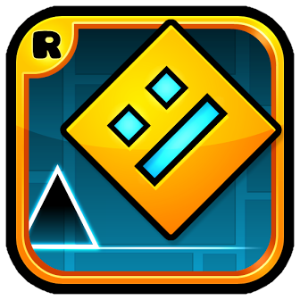

# Pix2GD
Pix2GD lets you import pixel art images directly into your Geometry Dash levels with ease. The mod converts your image into objects while optimizing the result to use as few objects as possible, helping keep your levels object count low.

Although Pix2GD is designed specifically for pixel art, it can also import other types of images. However, this mod was made specifically for pixel art and there are other tools that produce better results for detailed or non-pixel images.

Pix2GD was created to make it easier to design pixel art outside of Geometry Dash and then import it directly into your level. This allows you to use your preferred art tool instead of designing the pixel art directly in the Geometry Dash editor.

Try to only import artwork that you own or have permission to use, if it's going to be used in a published level.

## Installation
You can install Pix2GD through Geode. After installing Geode, simply search for the mod on the in-game browser, and click install.
